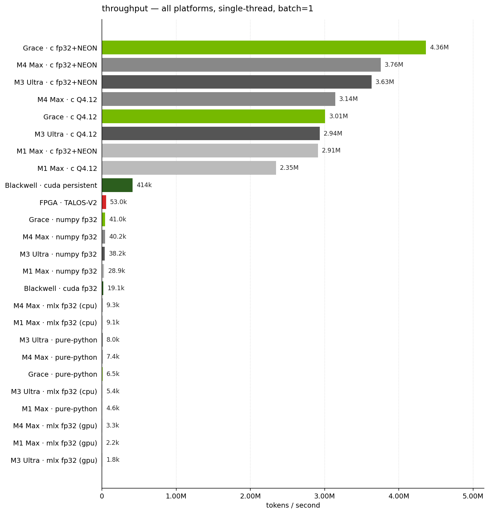
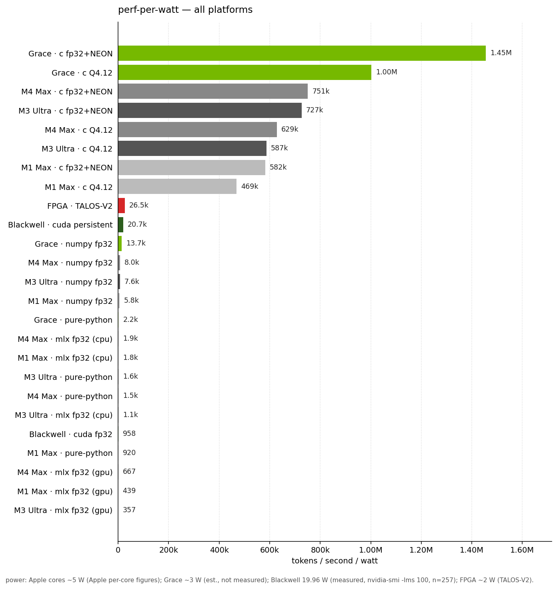

# talos-vs-macbook

Have you ever wanted to know whether 50,000 tokens/sec on a custom FPGA is impressive? It is and it isn't. This repo runs Karpathy's [microGPT](https://gist.github.com/karpathy/8627fe009c40f57531cb18360106ce95) — a 4,192-parameter character-level transformer — in five different ways on an M4 Max MacBook Pro and compares them to [TALOS-V2](https://github.com/Luthiraa/TALOS-V2)'s 53,000 tok/sec hardware implementation on a Cyclone V FPGA.

The model is so small (~17 KB at fp32) that it fits in L1 cache and the whole forward pass is ~4,000 multiply-accumulates per token. That makes the benchmark less about arithmetic and more about *overhead*. The interesting question turns out to be: which implementations even *beat* the FPGA?

```
implementation                tok/sec      vs FPGA
----------------------  --------------  -----------
pure-python                      7,430        0.14x
numpy fp32                      40,244        0.76x   <- slower than the FPGA!
mlx fp32 (cpu)                   9,350        0.18x
mlx fp32 (gpu)                   3,337        0.06x   <- much slower
c fp32+NEON                  3,756,165       70.87x
c Q4.12 fixed-point          3,143,586       59.31x
TALOS-V2 (FPGA, 56MHz)          53,000        1.00x
```

A single M4 Max MacBook Pro P-core in well-tuned C does **~71×** the FPGA's throughput. NumPy and MLX both come in *under* the FPGA: their per-call dispatch overhead is bigger than the actual work. MLX-on-GPU is the worst — kernel launch overhead annihilates a 4K-MAC forward pass. lol.


And on perf-per-watt — assuming ~5 W for one M4 Max P-core under load and ~2 W for the Cyclone V fabric — the MacBook still wins by a wide margin. TALOS sits comfortably above the Python and MLX bars (Python overhead is just wasted power) but the C versions clear it by ~25–30×.


## try it yourself

```bash
git clone https://github.com/AlexCheema/talos-vs-macbook && cd talos-vs-macbook && ./run.sh
```

That's it. The script fetches microGPT's trained weights from upstream, builds the C versions with `clang -O3 -march=native -ffast-math`, and runs all five implementations back-to-back. Takes about 90 seconds total. You only need `python3`, `numpy`, `make`, and `clang` (all already on a stock Mac); MLX is optional (`pip install mlx` if you want those rows).

## what's in here

Each implementation is a single self-contained file. No frameworks pulled in past what's strictly needed.

| file | what | lines |
| --- | --- | --- |
| `pure_python.py` | Karpathy's reference forward pass, dependency-free Python. The slow baseline. | 130 |
| `bench_numpy.py` | NumPy fp32, BLAS pinned to 1 thread, KV cache. | 138 |
| `bench_mlx.py` | Same forward pass in [MLX](https://github.com/ml-explore/mlx), Apple's M-series-tuned framework. CPU and GPU. | 122 |
| `bench_c.c` | Hand-written C with NEON intrinsics. fp32. The ceiling. | 268 |
| `bench_c_q412.c` | Same, but with Q4.12 fixed-point matmuls — the exact arithmetic TALOS uses. | 270 |
| `model.py` | Shared loader + sampler. | 66 |

About 1,000 lines total across all five implementations. Same model, same weights, same multinomial sampling, same temperature 0.5, same single-thread batch=1 char-by-char autoregressive setup.

## sample output

Each implementation generates the same kinds of name-like strings. The Python ones (sharing Python's `random.choices`) produce identical output:

```
sample  1: kana
sample  2: keelan
sample  3: alilan
sample  4: ariel
sample  5: cairi
sample  6: mayan
sample  7: kenia
sample  8: akalen
sample  9: danyli
sample 10: man
```

Run `python3 pure_python.py --names` (or `bench_numpy.py --names`, `bench_mlx.py --names`, `./bench_c --names`, `./bench_c_q412 --names`) to see your own.

## why is NumPy slower than the FPGA?

The model is genuinely tiny. One forward pass is roughly:

- 3 RMSNorms: ~100 FLOPs
- 4 matmuls of shape (16,16)·(16,): 4 × 256 = 1,024 FMAs
- attention with up to 16 keys: ~256 FMAs
- 1 matmul (64,16)·(16,) + 1 matmul (16,64)·(64,): 2,048 FMAs
- 1 lm_head matmul (27,16)·(16,): 432 FMAs

Round it to ~4,000 multiply-accumulates per token. At single-thread M4 Max MacBook Pro NEON throughput (~16 GFLOPS in scalar fp32, much more with FMA pipelines), the *arithmetic* takes well under a microsecond. So if you can dispatch the work in <1 µs you'll fly; otherwise you don't.

NumPy's per-call overhead (Python ↔ C boundary, dtype dispatch, broadcast checks) is in the few-microseconds range. With ~25 ops per token × ~1 µs each, you're already at 25 µs/token = 40k tok/sec — which is exactly what we measure. The numbers aren't a NumPy weakness; they're a model-too-small situation.

MLX-on-GPU is even worse because Metal kernel launches are tens of microseconds each. Apple silicon is brilliant; it's just not the right tool for a 4,000-MAC workload. This is why people batch.

The FPGA wins on *absolute* power draw — a Cyclone V on the DE1-SoC pulls maybe 2 W; one M4 Max MacBook Pro P-core under this load is more like 5 W — but with ~71× the throughput at ~2.5× the power, the MacBook wins on perf-per-watt by roughly an order of magnitude (~28×) too. The FPGA's real advantages are form factor and deterministic latency: you can run TALOS off a battery on something credit-card sized, you can't run a MacBook there. To match TALOS in C we use about 1.4% of one core's time.

## how the C version works

`bench_c.c` is the interesting one. The trick is that the model is small enough that everything — weights (16 KB), KV cache (2 KB), all activations — fits in L1 D-cache. So the bottleneck is purely instruction throughput.

Each matmul is hand-unrolled. The (R,16)·(16,) shape is perfect for NEON: load the 16-element input vector once into four `float32x4_t` registers, then for each output row compute 4 fused multiply-adds and a horizontal reduce. The (16,64)·(64,) MLP-out matmul fully unrolls the inner 64-element dot product. RMSNorm reduces with `vaddvq_f32`. Sampling is xorshift32 + cumulative scan.

The Q4.12 version is the same structure but with `int16_t` weights and `vmlal_s16` widening MACs into `int32_t` accumulators, shifted right by 12 between layers. RMSNorm and softmax stay in float (TALOS uses LUTs and Newton iterations for these in hardware). Quantization error vs fp32 is ~0.0001 per weight, and several generated names match between the fp32 and Q4.12 versions byte-for-byte.

## extras: M3 Ultra, M1 Max, DGX Spark

Same code, more hardware. The C+NEON path is portable Armv8/9 and builds cleanly on M3 Ultra, M1 Max, and the Grace ARM cores in NVIDIA's [DGX Spark](https://www.nvidia.com/en-us/products/workstations/dgx-spark/). The DGX Spark also has a Blackwell GPU on the same package, so we threw in two CUDA implementations as well — a naïve launch-per-op baseline and a fused persistent kernel (`bench_cuda.cu`, `bench_cuda_persistent.cu`, ~560 lines together). The M4 Max story above is unchanged; this section just lays out where the same forward pass lands on other hardware.

```
implementation                       tok/sec      vs FPGA
-----------------------------  --------------  -----------
Grace · c fp32+NEON                4,364,405       82.35x
M4 Max · c fp32+NEON               3,756,165       70.87x
M3 Ultra · c fp32+NEON             3,632,988       68.55x
M4 Max · c Q4.12                   3,143,586       59.31x
Grace · c Q4.12                    3,007,686       56.75x
M3 Ultra · c Q4.12                 2,935,620       55.39x
M1 Max · c fp32+NEON               2,910,293       54.91x
M1 Max · c Q4.12                   2,345,483       44.25x
Blackwell · cuda persistent          413,603        7.80x
TALOS-V2 (FPGA, 56MHz)                53,000        1.00x
Grace · numpy fp32                    41,032        0.77x
M4 Max · numpy fp32                   40,244        0.76x
M3 Ultra · numpy fp32                 38,175        0.72x
M1 Max · numpy fp32                   28,866        0.54x
Blackwell · cuda fp32 (naive)         19,127        0.36x
M4 Max · mlx fp32 (cpu)                9,350        0.18x
M1 Max · mlx fp32 (cpu)                9,122        0.17x
M3 Ultra · pure-python                 8,039        0.15x
M4 Max · pure-python                   7,430        0.14x
Grace · pure-python                    6,455        0.12x
M3 Ultra · mlx fp32 (cpu)              5,407        0.10x
M1 Max · pure-python                   4,600        0.09x
M4 Max · mlx fp32 (gpu)                3,337        0.06x
M1 Max · mlx fp32 (gpu)                2,196        0.04x
M3 Ultra · mlx fp32 (gpu)              1,785        0.03x
```



A few observations:

**Apple silicon scales with clock and microarch.** M4 Max 3.76M (~4.4 GHz) > M3 Ultra 3.63M (~4.05 GHz) > M1 Max 2.91M (~3.2 GHz Firestorm). M1 Max's Q4.12 path is ~30% behind its own fp32, vs ~17% on M4 Max — Apple's `int16` widening MAC pipeline got noticeably wider between 2021 and 2024.

**Grace edges out M4 Max by 16% on the same C.** A single Cortex-X925 (3.9 GHz boost) is the wider ARMv9 core; the NEON path is portable Armv8/9, no Apple-specific intrinsics. On Linux glibc the link line needs `-lm -lmvec` because gcc's auto-vectorised `expf` in the attention softmax pulls in libmvec.

**NumPy under the FPGA replicates on Grace.** 41,032 tok/sec there, despite OpenBLAS on aarch64 Linux being completely different from Apple's Accelerate. The bottleneck is the Python ↔ C boundary, not BLAS, so the number is roughly platform-flat.

**Naïve CUDA loses to the FPGA, persistent CUDA beats it.** ~19k tok/sec for `bench_cuda.cu` (one launch per matmul / RMSNorm / softmax / sample, with the token id round-tripping host↔device every step) — same launch-overhead pattern as MLX-on-GPU, just on a different launch surface. `bench_cuda_persistent.cu` pins all 4,192 fp32 weights in shared memory and runs the entire timed window in a single launch — 413K tok/sec, 7.8× the FPGA. Still ~10× slower than every C core in the table, though.



On perf-per-watt — assuming ~3 W per Grace core (estimated, not measured), ~5 W per Apple P-core, 19.96 W for Blackwell during the persistent kernel run (`nvidia-smi --query-gpu=power.draw -lms 100`, n=257), and ~2 W for the Cyclone V — Grace c+NEON wins outright at ~1.45M tok/sec/W. Apple's C+NEON paths come next at ~700–750k tok/sec/W. The FPGA at 26.5k still beats Blackwell's 20.7k on watts; the FPGA's 2 W floor wins efficiency even when CUDA wins absolute throughput.

### try it on DGX Spark

```bash
git clone https://github.com/AlexCheema/talos-vs-macbook && cd talos-vs-macbook && ./run_gx10.sh
```

Builds the same Python + C benchmarks plus both CUDA paths. Needs `nvcc` (CUDA 13, `-arch=sm_121` for Blackwell GB10), `gcc 13+`, glibc with `libmvec`, and `python3 + numpy`. The Makefile is gated on `nvcc` being present, so the Apple Silicon path is unchanged.

### how the persistent CUDA kernel works

`bench_cuda_persistent.cu` launches one block of 32 threads — a single warp — and runs the entire timed window in that one launch. On entry the warp co-loads all 4,192 fp32 weights into shared memory and zeros the KV cache. Then a per-token loop runs the full forward pass without leaving the kernel:

- RMSNorm uses warp-shuffle reductions (`__shfl_xor_sync`) — no shared-memory scratch.
- Each (R, EMBD) matvec is one thread per output row — 16 lanes for the 16-wide outputs, all 32 active when R=64 (each thread handles two MLP rows).
- Attention runs one thread per head: 4 lanes do the dot-product / softmax / weighted-sum independently across the 4 heads.
- Sampling is xorshift32 + cumulative scan on lane 0, broadcast back via `__shfl_sync`.

Crucially, the next iteration just continues the loop. No relaunch, no host roundtrip, no global memory traffic for activations between tokens. Only the KV cache writes touch shared memory across iterations. The only host involvement during timing is `cudaDeviceSynchronize()` at the very end. The naïve `bench_cuda.cu` loses 22× to this — almost all of that gap is launch overhead, not arithmetic.

### why is Blackwell slower than Grace?

A single Grace core in C+NEON does 4.36M tok/sec. The persistent CUDA kernel does 413K tok/sec on Blackwell. **A 10.5× gap on identical work.** The model still fits in cache on both sides, so it's not memory bandwidth.

Two factors stack. **Clock:** Grace's Cortex-X925 boosts to ~3.9 GHz; a Blackwell SM in GB10 clocks at ~1.5–2 GHz, ~2× behind on raw clock. **Active SIMT lanes:** a single warp does 1 instruction per warp-clock across 32 lanes. On this model that's only 16 lanes during the (R, EMBD) matvecs, 4 during attention, and 1 during the sampler. Effective lane utilisation is roughly 50%, so useful ops per warp-clock end up similar to what one Grace core issues per cycle through its wide out-of-order + 4-lane NEON FMA pipes — but at half the wall-clock rate.

2× clock × 2× IPC + a small per-op `__syncwarp` overhead across ~25 sequential ops ≈ 10×. Matches the measured ratio. The persistent kernel isn't doing anything wrong — single-stream char-by-char inference at this scale just isn't where GPUs live. *Multiple* persistent kernels — one block per SM, ~80 SMs on GB10 — would scale linearly: >30M tok/sec batched throughput on the same hardware. Different question, different answer.

## todos

- multi-thread version with 12 independent sampling streams (would scale to ~45M tok/sec, probably)
- a Metal compute shader version (just to confirm the GPU launch-overhead theory directly on Apple silicon)
- batched throughput numbers (where MLX would actually shine)
- multi-stream persistent CUDA: N independent streams, N blocks. With ~80 SMs on GB10 and 413k tok/sec/stream that's potentially >30M tok/sec batched throughput.
- multi-thread C on Grace's 10 X925 cores — extrapolating from 4.36M/core, ~40M tok/sec.
- direct power measurement on Apple silicon and Grace, to retire the ~5 W and ~3 W per-core estimates

## references

- [TALOS-V2](https://github.com/Luthiraa/TALOS-V2) by Luthira Abeykoon, the FPGA implementation we're comparing to. Worth reading; the RTL is genuinely tight.
- [microGPT](https://gist.github.com/karpathy/8627fe009c40f57531cb18360106ce95) by Andrej Karpathy, the 200-line dependency-free transformer + autograd that started this. Trained weights from the TALOS repo.
- [makemore](https://github.com/karpathy/makemore), the names dataset and the larger family this came from.
- [MLX](https://github.com/ml-explore/mlx), Apple's array framework.
- [NVIDIA DGX Spark](https://www.nvidia.com/en-us/products/workstations/dgx-spark/) and the [GB10 superchip](https://www.nvidia.com/en-us/data-center/grace-cpu/) — the Grace + Blackwell desktop platform used for the CUDA and Grace ARM rows in the extras section.
- [Persistent threads / persistent blocks](https://research.nvidia.com/publication/2012-06_understanding-efficiency-ray-traversal-gpus-kepler-and-fermi-addendum) — the GPU-side pattern that `bench_cuda_persistent.cu` uses. Aila & Laine, NVIDIA Research, 2012.
- [glibc libmvec](https://sourceware.org/glibc/wiki/libmvec) — auto-vectorized math (`_ZGVnN4v_expf` for AArch64 NEON) that gcc's `-O3 -ffast-math` emits in the attention softmax. Required at link time on Linux: `-lm -lmvec`.

## license

MIT
