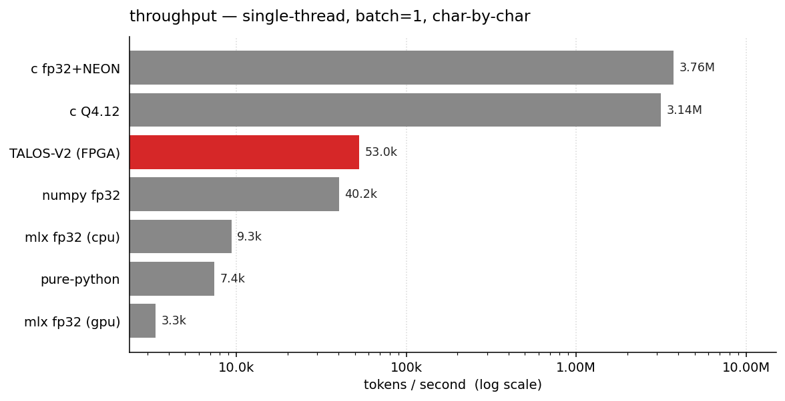
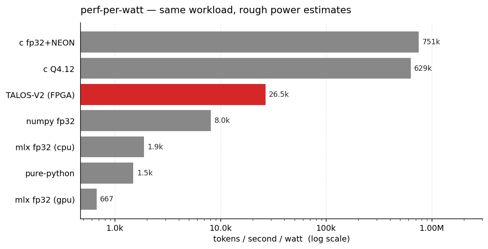

# talos-vs-macbook

Have you ever wanted to know whether 50,000 tokens/sec on a custom FPGA is impressive? It is and it isn't. This repo runs Karpathy's [microGPT](https://gist.github.com/karpathy/8627fe009c40f57531cb18360106ce95) — a 4,192-parameter character-level transformer — in five different ways on an M4 Max MacBook Pro and compares them to [TALOS-V2](https://github.com/Luthiraa/TALOS-V2)'s 53,000 tok/sec hardware implementation on a Cyclone V FPGA.

The model is so small (~17 KB at fp32) that it fits in L1 cache and the whole forward pass is ~4,000 multiply-accumulates per token. That makes the benchmark less about arithmetic and more about *overhead*. The interesting question turns out to be: which implementations even *beat* the FPGA?

```
implementation                      tok/sec      vs FPGA
----------------------------  --------------  -----------
pure-python                            7,430        0.14x
numpy fp32                            40,244        0.76x   <- slower than the FPGA!
mlx fp32 (cpu)                         9,350        0.18x
mlx fp32 (gpu)                         3,337        0.06x   <- much slower
c fp32+NEON                        3,756,165       70.87x
c Q4.12 fixed-point                3,143,586       59.31x
TALOS-V2 (FPGA, 56MHz)                53,000        1.00x
```

A single M4 Max MacBook Pro P-core in well-tuned C does **~71×** the FPGA's throughput. NumPy and MLX both come in *under* the FPGA: their per-call dispatch overhead is bigger than the actual work. MLX-on-GPU is the worst — kernel launch overhead annihilates a 4K-MAC forward pass. lol.



And on perf-per-watt — assuming ~5 W for one M4 Max P-core under load and ~2 W for the Cyclone V fabric — the MacBook still wins by a wide margin. TALOS sits comfortably above the Python and MLX bars (Python overhead is just wasted power) but the C versions clear it by ~25–30×.



## try it yourself

On any Apple Silicon Mac:

```bash
git clone https://github.com/AlexCheema/talos-vs-macbook && cd talos-vs-macbook && ./run.sh
```

That's it. The script fetches microGPT's trained weights from upstream, builds the C versions with `clang -O3 -march=native -ffast-math`, and runs all six implementations back-to-back. Takes about 90 seconds total. You only need `python3`, `numpy`, `make`, and `clang` (all already on a stock Mac); MLX is optional (`pip install mlx` if you want those rows).

## what's in here

Each implementation is a single self-contained file. No frameworks pulled in past what's strictly needed.

| file | what | lines |
| --- | --- | --- |
| `pure_python.py` | Karpathy's reference forward pass, dependency-free Python. The slow baseline. | 130 |
| `bench_numpy.py` | NumPy fp32, BLAS pinned to 1 thread, KV cache. | 138 |
| `bench_mlx.py` | Same forward pass in [MLX](https://github.com/ml-explore/mlx), Apple's M-series-tuned framework. CPU and GPU. | 122 |
| `bench_c.c` | Hand-written C with NEON intrinsics. fp32. The ceiling. | 268 |
| `bench_c_q412.c` | Same, but with Q4.12 fixed-point matmuls — the exact arithmetic TALOS uses. | 270 |
| `model.py` | Shared loader + sampler. | 66 |

About 1,000 lines total across all five implementations. Same model, same weights, same multinomial sampling, same temperature 0.5, same single-thread batch=1 char-by-char autoregressive setup.

## sample output

Each implementation generates the same kinds of name-like strings. The Python ones (sharing Python's `random.choices`) produce identical output:

```
sample  1: kana
sample  2: keelan
sample  3: alilan
sample  4: ariel
sample  5: cairi
sample  6: mayan
sample  7: kenia
sample  8: akalen
sample  9: danyli
sample 10: man
```

Run `python3 pure_python.py --names` (or `bench_numpy.py --names`, `bench_mlx.py --names`, `./bench_c --names`, `./bench_c_q412 --names`) to see your own.

## why is NumPy slower than the FPGA?

The model is genuinely tiny. One forward pass is roughly:

- 3 RMSNorms: ~100 FLOPs
- 4 matmuls of shape (16,16)·(16,): 4 × 256 = 1,024 FMAs
- attention with up to 16 keys: ~256 FMAs
- 1 matmul (64,16)·(16,) + 1 matmul (16,64)·(64,): 2,048 FMAs
- 1 lm_head matmul (27,16)·(16,): 432 FMAs

Round it to ~4,000 multiply-accumulates per token. At single-thread M4 Max MacBook Pro NEON throughput (~16 GFLOPS in scalar fp32, much more with FMA pipelines), the *arithmetic* takes well under a microsecond. So if you can dispatch the work in <1 µs you'll fly; otherwise you don't.

NumPy's per-call overhead (Python ↔ C boundary, dtype dispatch, broadcast checks) is in the few-microseconds range. With ~25 ops per token × ~1 µs each, you're already at 25 µs/token = 40k tok/sec — which is exactly what we measure. The numbers aren't a NumPy weakness; they're a model-too-small situation.

MLX-on-GPU is even worse because Metal kernel launches are tens of microseconds each. Apple silicon is brilliant; it's just not the right tool for a 4,000-MAC workload. This is why people batch.

The FPGA wins on *absolute* power draw — a Cyclone V on the DE1-SoC pulls maybe 2 W; one M4 Max MacBook Pro P-core under this load is more like 5 W — but with ~71× the throughput at ~2.5× the power, the MacBook wins on perf-per-watt by roughly an order of magnitude (~28×) too. The FPGA's real advantages are form factor and deterministic latency: you can run TALOS off a battery on something credit-card sized, you can't run a MacBook there. To match TALOS in C we use about 1.4% of one core's time.

## how the C version works

`bench_c.c` is the interesting one. The trick is that the model is small enough that everything — weights (16 KB), KV cache (2 KB), all activations — fits in L1 D-cache. So the bottleneck is purely instruction throughput.

Each matmul is hand-unrolled. The (R,16)·(16,) shape is perfect for NEON: load the 16-element input vector once into four `float32x4_t` registers, then for each output row compute 4 fused multiply-adds and a horizontal reduce. The (16,64)·(64,) MLP-out matmul fully unrolls the inner 64-element dot product. RMSNorm reduces with `vaddvq_f32`. Sampling is xorshift32 + cumulative scan.

The Q4.12 version is the same structure but with `int16_t` weights and `vmlal_s16` widening MACs into `int32_t` accumulators, shifted right by 12 between layers. RMSNorm and softmax stay in float (TALOS uses LUTs and Newton iterations for these in hardware). Quantization error vs fp32 is ~0.0001 per weight, and several generated names match between the fp32 and Q4.12 versions byte-for-byte.

## todos

- multi-thread version with 12 independent sampling streams (would scale to ~45M tok/sec, probably)
- a Metal compute shader version (just to confirm the GPU launch-overhead theory)
- batched throughput numbers (where MLX would actually shine)
- power measurements on both sides for a fair perf/W comparison

## references

- [TALOS-V2](https://github.com/Luthiraa/TALOS-V2) by Luthira Abeykoon, the FPGA implementation we're comparing to. Worth reading; the RTL is genuinely tight.
- [microGPT](https://gist.github.com/karpathy/8627fe009c40f57531cb18360106ce95) by Andrej Karpathy, the 200-line dependency-free transformer + autograd that started this. Trained weights from the TALOS repo.
- [makemore](https://github.com/karpathy/makemore), the names dataset and the larger family this came from.
- [MLX](https://github.com/ml-explore/mlx), Apple's array framework.

## license

MIT
