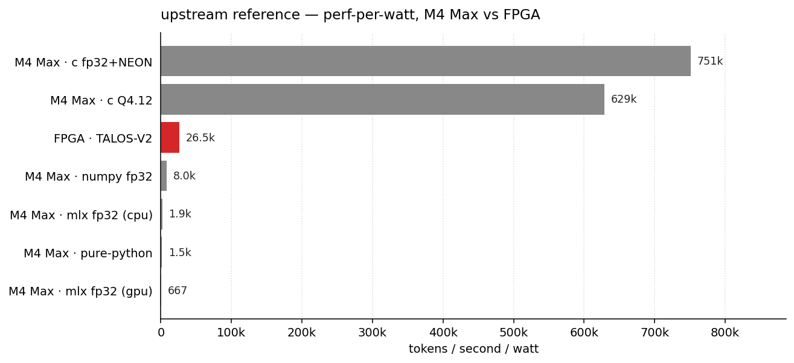

# talos-vs-macbook

Have you ever wanted to know whether 50,000 tokens/sec on a custom FPGA is impressive? It is and it isn't. This repo runs Karpathy's [microGPT](https://gist.github.com/karpathy/8627fe009c40f57531cb18360106ce95) — a 4,192-parameter character-level transformer — in five different ways on an M4 Max MacBook Pro and compares them to [TALOS-V2](https://github.com/Luthiraa/TALOS-V2)'s 53,000 tok/sec hardware implementation on a Cyclone V FPGA.

The model is so small (~17 KB at fp32) that it fits in L1 cache and the whole forward pass is ~4,000 multiply-accumulates per token. That makes the benchmark less about arithmetic and more about *overhead*. The interesting question turns out to be: which implementations even *beat* the FPGA?

```
implementation                      tok/sec      vs FPGA
----------------------------  --------------  -----------
pure-python                            7,430        0.14x
numpy fp32                            40,244        0.76x   <- slower than the FPGA!
mlx fp32 (cpu)                         9,350        0.18x
mlx fp32 (gpu)                         3,337        0.06x   <- much slower
c fp32+NEON                        3,756,165       70.87x
c Q4.12 fixed-point                3,143,586       59.31x
TALOS-V2 (FPGA, 56MHz)                53,000        1.00x
```

A single M4 Max MacBook Pro P-core in well-tuned C does **~71×** the FPGA's throughput. NumPy and MLX both come in *under* the FPGA: their per-call dispatch overhead is bigger than the actual work. MLX-on-GPU is the worst — kernel launch overhead annihilates a 4K-MAC forward pass. lol.


And on perf-per-watt — assuming ~5 W for one M4 Max P-core under load and ~2 W for the Cyclone V fabric — the MacBook still wins by a wide margin. TALOS sits comfortably above the Python and MLX bars (Python overhead is just wasted power) but the C versions clear it by ~25–30×.



## also on M3 Ultra, M1 Max, and NVIDIA DGX Spark

Same workload, more silicon. Three Apple chips and one DGX Spark (NVIDIA GB10 — 20-core Grace ARM CPU plus a Blackwell GPU sharing 128 GB of unified memory). The Blackwell experiments are mostly here for the sheer hell of it — single-thread C on any of these CPUs already buries the FPGA — but the question of whether a fused persistent CUDA kernel can dodge the launch-overhead curse that wrecked MLX-on-GPU seemed worth a real answer.

```
implementation                      tok/sec      vs FPGA
----------------------------  --------------  -----------
Grace · c fp32+NEON                4,364,405       82.35x   <- new headline
M4 Max · c fp32+NEON               3,756,165       70.87x
M3 Ultra · c fp32+NEON             3,632,988       68.55x
M4 Max · c Q4.12                   3,143,586       59.31x
Grace · c Q4.12                    3,007,686       56.75x
M3 Ultra · c Q4.12                 2,935,620       55.39x
M1 Max · c fp32+NEON               2,910,293       54.91x
M1 Max · c Q4.12                   2,345,483       44.25x
Blackwell · cuda persistent          413,603        7.80x
TALOS-V2 (FPGA, 56MHz)                53,000        1.00x
Grace · numpy fp32                    41,032        0.77x
M4 Max · numpy fp32                   40,244        0.76x
M3 Ultra · numpy fp32                 38,175        0.72x
M1 Max · numpy fp32                   28,866        0.54x
Blackwell · cuda fp32 (naive)         19,127        0.36x
M4 Max · mlx fp32 (cpu)                9,350        0.18x
M1 Max · mlx fp32 (cpu)                9,122        0.17x
M3 Ultra · pure-python                 8,039        0.15x
M4 Max · pure-python                   7,430        0.14x
Grace · pure-python                    6,455        0.12x
M3 Ultra · mlx fp32 (cpu)              5,407        0.10x
M1 Max · pure-python                   4,600        0.09x
M4 Max · mlx fp32 (gpu)                3,337        0.06x
M1 Max · mlx fp32 (gpu)                2,196        0.04x
M3 Ultra · mlx fp32 (gpu)              1,785        0.03x
```

Three things stand out.

**A single Grace core (Cortex-X925 at 3.9 GHz boost) hits 4,364,405 tok/sec on the same hand-rolled C+NEON — 16% above M4 Max.** ARMv9's wider NEON throughput beats M4 Max's higher clock on this workload. Same forward pass, same ~4,000 MACs, same L1 fit. X925 just throws more pipes per cycle at it.

**The persistent CUDA kernel hits 413,603 tok/sec on Blackwell — 7.8× the FPGA — but still ~9× slower than every C core in the table.** One SM running at warp width can't out-throughput a 3–4 GHz wide-issue out-of-order CPU on a 4K-MAC pass. Multi-stream persistent kernels would scale linearly with SMs (~80 of them on GB10), but that's batched throughput — different question.

**Naïve `cuda fp32` (one launch per matmul / RMSNorm / softmax / sample) scrapes 19,127 tok/sec.** Under the FPGA. Same death-by-launch-overhead pattern that wrecked MLX-on-GPU, but on Blackwell. Kernel launches on this GPU are cheaper than Metal's — it beats M4 Max MLX-on-GPU 6× — but still not even close to useful for single-stream char-by-char inference.

Across Apple silicon, c+NEON tracks clock and microarch generation roughly linearly: M4 Max 3.76M (~4.4 GHz) > M3 Ultra 3.63M (~4.05 GHz) > M1 Max 2.91M (~3.2 GHz Firestorm). M1 Max's Q4.12 path is ~30% behind its own fp32, vs ~17% on M4 Max — Apple's int16 widening MAC pipeline got noticeably wider between 2021 and 2024.

Power on Blackwell averaged **19.96 W** during the persistent run (idle floor 13.6 W, peak 20.6 W, n=257 samples at 100 ms via `nvidia-smi --query-gpu=power.draw`). That's 20.7k tok/sec/W — *under* the FPGA's 26.5k. The FPGA's 2 W floor wins efficiency even when CUDA wins absolute throughput. Grace per-core power is estimated ~3 W (not measured directly); even at a pessimistic 5 W, c+NEON on Grace still leads perf-per-watt.


## try it yourself

On any Apple Silicon Mac:

```bash
git clone https://github.com/AlexCheema/talos-vs-macbook && cd talos-vs-macbook && ./run.sh
```

That's it. The script fetches microGPT's trained weights from upstream, builds the C versions with `clang -O3 -march=native -ffast-math`, and runs all six implementations back-to-back. Takes about 90 seconds total. You only need `python3`, `numpy`, `make`, and `clang` (all already on a stock Mac); MLX is optional (`pip install mlx` if you want those rows).

On NVIDIA DGX Spark / GB10:

```bash
git clone https://github.com/AlexCheema/talos-vs-macbook && cd talos-vs-macbook && ./run_gx10.sh
```

Builds the same Python + C benchmarks plus both CUDA paths. Needs `nvcc` (CUDA 13, `-arch=sm_121` for Blackwell GB10), `gcc 13+`, glibc with `libmvec`, and `python3 + numpy`. The Makefile is gated on `nvcc` being present, so the existing Apple Silicon path is unchanged.

## what's in here

Each implementation is a single self-contained file. No frameworks pulled in past what's strictly needed.

| file | what | lines |
| --- | --- | --- |
| `pure_python.py` | Karpathy's reference forward pass, dependency-free Python. The slow baseline. | 130 |
| `bench_numpy.py` | NumPy fp32, BLAS pinned to 1 thread, KV cache. | 138 |
| `bench_mlx.py` | Same forward pass in [MLX](https://github.com/ml-explore/mlx), Apple's M-series-tuned framework. CPU and GPU. | 122 |
| `bench_c.c` | Hand-written C with NEON intrinsics. fp32. The ceiling. | 268 |
| `bench_c_q412.c` | Same, but with Q4.12 fixed-point matmuls — the exact arithmetic TALOS uses. | 270 |
| `bench_cuda.cu` | Naïve launch-per-op CUDA, fp32. The "use the GPU like an accelerator" path. | 290 |
| `bench_cuda_persistent.cu` | Single persistent CUDA kernel; weights pinned in shared mem, full forward pass + sampler stays on-device. | 270 |
| `model.py` | Shared loader + sampler. | 66 |

About 1,600 lines across all seven implementations. Same model, same weights, same multinomial sampling, same temperature 0.5, same single-thread batch=1 char-by-char autoregressive setup.

## sample output

Each implementation generates the same kinds of name-like strings. The Python ones (sharing Python's `random.choices`) produce identical output:

```
sample  1: kana
sample  2: keelan
sample  3: alilan
sample  4: ariel
sample  5: cairi
sample  6: mayan
sample  7: kenia
sample  8: akalen
sample  9: danyli
sample 10: man
```

Run `python3 pure_python.py --names` (or `bench_numpy.py --names`, `bench_mlx.py --names`, `./bench_c --names`, `./bench_c_q412 --names`, `./bench_cuda --names`, `./bench_cuda_persistent --names`) to see your own. The CUDA paths use the same xorshift32 sampler as the C versions; both `bench_cuda --names` and `bench_cuda_persistent --names` produce byte-identical output to each other, confirming the fused persistent kernel matches the launch-per-op baseline.

## why is NumPy slower than the FPGA?

The model is genuinely tiny. One forward pass is roughly:

- 3 RMSNorms: ~100 FLOPs
- 4 matmuls of shape (16,16)·(16,): 4 × 256 = 1,024 FMAs
- attention with up to 16 keys: ~256 FMAs
- 1 matmul (64,16)·(16,) + 1 matmul (16,64)·(64,): 2,048 FMAs
- 1 lm_head matmul (27,16)·(16,): 432 FMAs

Round it to ~4,000 multiply-accumulates per token. At single-thread M4 Max MacBook Pro NEON throughput (~16 GFLOPS in scalar fp32, much more with FMA pipelines), the *arithmetic* takes well under a microsecond. So if you can dispatch the work in <1 µs you'll fly; otherwise you don't.

NumPy's per-call overhead (Python ↔ C boundary, dtype dispatch, broadcast checks) is in the few-microseconds range. With ~25 ops per token × ~1 µs each, you're already at 25 µs/token = 40k tok/sec — which is exactly what we measure. The numbers aren't a NumPy weakness; they're a model-too-small situation.

MLX-on-GPU is even worse because Metal kernel launches are tens of microseconds each. Apple silicon is brilliant; it's just not the right tool for a 4,000-MAC workload. This is why people batch.

The same logic reproduces on Grace and Blackwell. NumPy fp32 on Grace lands at 41,032 tok/sec — *also* under the FPGA — despite the underlying BLAS being completely different from Apple's (OpenBLAS on aarch64 Linux vs Accelerate). The bottleneck isn't BLAS, it's the Python ↔ C boundary, so the number is roughly platform-flat across all three Apple chips and Grace. And `bench_cuda` (naïve launch-per-op CUDA) lands at 19,127 tok/sec on Blackwell — same death-by-launch-overhead pattern, just on a different launch surface. Kernel launches on Blackwell are *cheaper* than Metal's (naïve CUDA beats M4 Max MLX-on-GPU 6×) but with ~25 launches plus a host↔device token-id round-trip per token, you're at ~50 µs/token = ~19k tok/sec. Same disease, different syringe.

The FPGA wins on *absolute* power draw — a Cyclone V on the DE1-SoC pulls maybe 2 W; one M4 Max MacBook Pro P-core under this load is more like 5 W — but with ~71× the throughput at ~2.5× the power, the MacBook wins on perf-per-watt by roughly an order of magnitude (~28×) too. The FPGA's real advantages are form factor and deterministic latency: you can run TALOS off a battery on something credit-card sized, you can't run a MacBook there. To match TALOS in C we use about 1.4% of one core's time.

## how the C version works

`bench_c.c` is the interesting one. The trick is that the model is small enough that everything — weights (16 KB), KV cache (2 KB), all activations — fits in L1 D-cache. So the bottleneck is purely instruction throughput.

Each matmul is hand-unrolled. The (R,16)·(16,) shape is perfect for NEON: load the 16-element input vector once into four `float32x4_t` registers, then for each output row compute 4 fused multiply-adds and a horizontal reduce. The (16,64)·(64,) MLP-out matmul fully unrolls the inner 64-element dot product. RMSNorm reduces with `vaddvq_f32`. Sampling is xorshift32 + cumulative scan.

The Q4.12 version is the same structure but with `int16_t` weights and `vmlal_s16` widening MACs into `int32_t` accumulators, shifted right by 12 between layers. RMSNorm and softmax stay in float (TALOS uses LUTs and Newton iterations for these in hardware). Quantization error vs fp32 is ~0.0001 per weight, and several generated names match between the fp32 and Q4.12 versions byte-for-byte.

The same `bench_c.c` and `bench_c_q412.c` build cleanly on Grace ARM (gcc 13.3, `-O3 -march=native -ffast-math`) — no Apple-specific intrinsics, the NEON path is portable Armv8/9. On Linux glibc the link line needs `-lm -lmvec` because gcc auto-vectorises the attention `expf` calls.

## how the persistent CUDA kernel works

`bench_cuda_persistent.cu` launches one block of 32 threads — a single warp — and runs the entire timed window in that one launch. On entry the warp co-loads all 4,192 fp32 weights into shared memory and zeros the KV cache. Then a per-token loop runs the full forward pass without leaving the kernel:

- RMSNorm uses warp-shuffle reductions (`__shfl_xor_sync`) — no shared-memory scratch.
- Each (R, EMBD) matvec is one thread per output row — 16 lanes for the 16-wide outputs, all 32 active when R=64 (each thread handles two MLP rows).
- Attention runs one thread per head: 4 lanes do the dot-product / softmax / weighted-sum independently across the 4 heads.
- Sampling is xorshift32 + cumulative scan on lane 0, broadcast back via `__shfl_sync`.

Crucially, the next iteration just continues the loop. No relaunch, no host roundtrip, no global memory traffic for activations between tokens. Only the KV cache writes touch shared memory across iterations. The only host involvement during timing is `cudaDeviceSynchronize()` at the very end.

This is the only path on the GPU that beats the FPGA. The naïve `bench_cuda.cu` (one launch per matmul / RMSNorm / softmax / sample, with the token id round-tripping host↔device every step) loses 22× to the persistent version — almost all of that gap is launch overhead, not arithmetic.

## why is Blackwell slower than Grace?

A single Grace core in C+NEON does 4.36M tok/sec. The persistent CUDA kernel — same forward pass, no relaunches, weights pinned in shared memory — does 413K tok/sec on Blackwell. **A 10.5× gap on identical work.** The model still fits in cache on both sides, so it's not memory bandwidth. Where does the gap go?

Two factors stack.

**Clock.** Grace's Cortex-X925 boosts to ~3.9 GHz; a Blackwell SM in GB10 clocks at ~1.5–2 GHz. Roughly 2× behind on raw clock before anything else.

**Active SIMT lanes.** A single warp does 1 instruction per warp-clock across 32 lanes. On this model that's only 16 lanes during the (R, EMBD) matvecs, 4 during attention (one per head), and 1 during the sampler. Effective lane utilisation across the forward pass is roughly 50%. Useful ops per warp-clock end up similar to what one Grace core issues per cycle through its wide out-of-order + 4-lane NEON FMA pipes — but the GPU is taking ~2× the wall-time per warp-clock because of clock.

2× clock × 2× IPC + a small per-op `__syncwarp` overhead across ~25 sequential ops ≈ 10×. Matches the measured ratio. The persistent kernel isn't doing anything wrong — single-stream char-by-char inference at this scale just isn't where GPUs live. *Multiple* persistent kernels — one block per SM, ~80 SMs on GB10 — would scale linearly: >30M tok/sec batched throughput on the same hardware. Different question, different answer.

## todos

- multi-thread version with 12 independent sampling streams (would scale to ~45M tok/sec, probably)
- multi-stream persistent CUDA: N independent streams, N blocks. With ~80 SMs on GB10 and 413k tok/sec/stream that's potentially >30M tok/sec batched throughput.
- multi-thread C on Grace's 10 X925 cores — extrapolating from 4.36M/core, ~40M tok/sec.
- a Metal compute shader version (just to confirm the GPU launch-overhead theory directly on Apple silicon)
- batched throughput numbers (where MLX would actually shine)
- direct power measurement on Apple silicon and Grace, to retire the ~5 W and ~3 W per-core estimates

## references

- [TALOS-V2](https://github.com/Luthiraa/TALOS-V2) by Luthira Abeykoon, the FPGA implementation we're comparing to. Worth reading; the RTL is genuinely tight.
- [microGPT](https://gist.github.com/karpathy/8627fe009c40f57531cb18360106ce95) by Andrej Karpathy, the 200-line dependency-free transformer + autograd that started this. Trained weights from the TALOS repo.
- [makemore](https://github.com/karpathy/makemore), the names dataset and the larger family this came from.
- [MLX](https://github.com/ml-explore/mlx), Apple's array framework.
- [NVIDIA DGX Spark](https://www.nvidia.com/en-us/products/workstations/dgx-spark/) and the [GB10 superchip](https://www.nvidia.com/en-us/data-center/grace-cpu/) — the Grace + Blackwell desktop platform used for the CUDA and Grace ARM rows.
- [NVIDIA CUDA Toolkit](https://developer.nvidia.com/cuda-toolkit) — `nvcc` 13.0 with `-arch=sm_121` for Blackwell GB10 (compute capability 12.1).
- [NVIDIA Blackwell architecture](https://www.nvidia.com/en-us/data-center/technologies/blackwell-architecture/) — the GPU side of the GB10.
- [Arm Cortex-X925](https://www.arm.com/products/silicon-ip-cpu/cortex-x/cortex-x925) — the ARMv9 performance core inside Grace; the wider NEON pipeline is what beats M4 Max single-thread on the C+NEON path.
- [Persistent threads / persistent blocks](https://research.nvidia.com/publication/2012-06_understanding-efficiency-ray-traversal-gpus-kepler-and-fermi-addendum) — the GPU-side pattern that `bench_cuda_persistent.cu` uses. Aila & Laine, NVIDIA Research, 2012. Originally for ray traversal but the principle is the same: keep the same kernel resident, feed it work, never relaunch.
- [glibc libmvec](https://sourceware.org/glibc/wiki/libmvec) — auto-vectorized math (`_ZGVnN4v_expf` for AArch64 NEON) that gcc's `-O3 -ffast-math` emits in the attention softmax. Required at link time on Linux: `-lm -lmvec`.

## license

MIT
